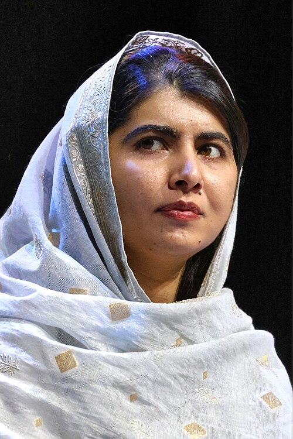
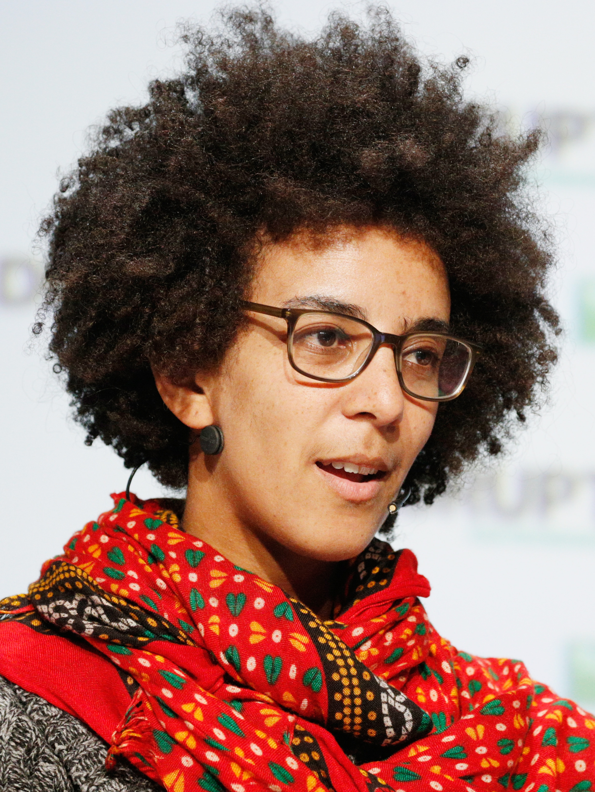
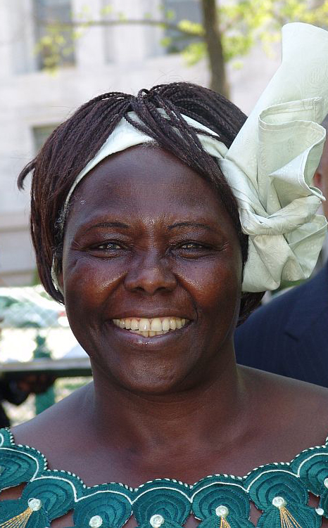
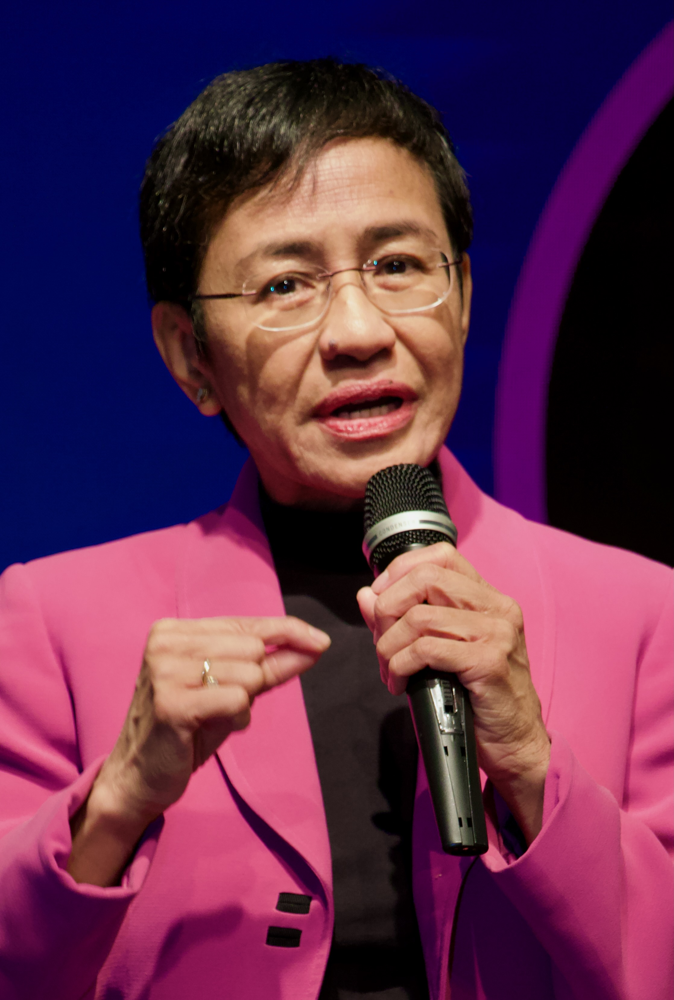
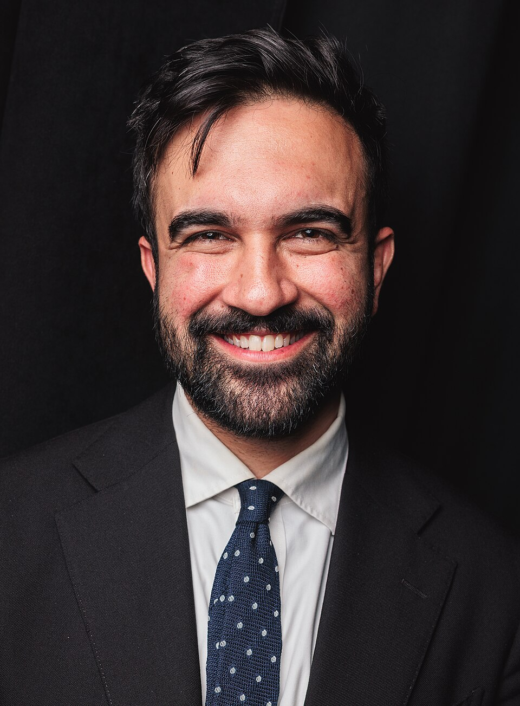
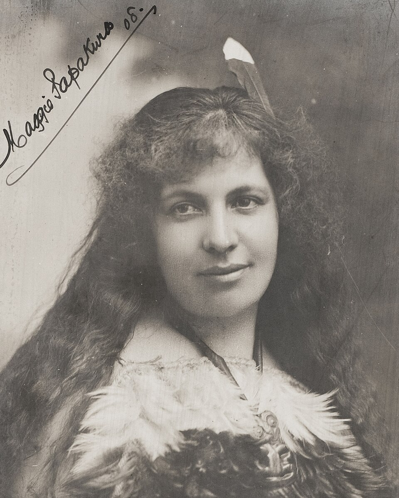
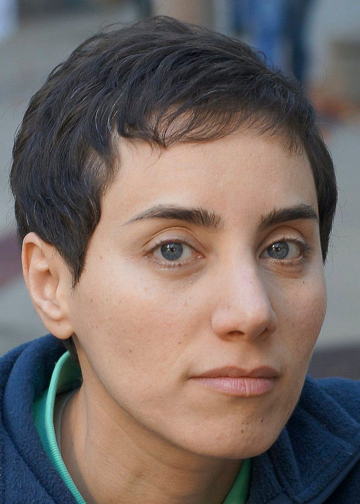

# {background-image="images/nemiks-manifesto.jpeg" .center .smaller}

["There will be times when the struggle seems impossible. I know this already. Alone, unsure, dwarfed by the scale of the enemy. Remember this. Freedom is a pure idea. It occurs spontaneously and without instruction. Random acts of insurrection are occurring constantly throughout the galaxy. There are whole armies, battalions that have no idea that they've already enlisted in the cause. Remember that the frontier of the Rebellion is everywhere. And even the smallest act of insurrection pushes our lines forward. And then remember this. The Imperial need for control is so desperate because it is so unnatural. Tyranny requires constant effort. It breaks, it leaks. Authority is brittle. Oppression is the mask of fear. Remember that. And know this, the day will come when all these skirmishes and battles, these moments of defiance will have flooded the banks of the Empire's authority and then there will be one too many. One single thing will break the siege. Remember this. Try."]{style="color:white;"}

[-- The Trail of Political Consciousness (Nemik's Manifesto)]{style="color:white;"}

# Team Malala {.smaller}

:::: {.columns}

::: {.column width="30%"}

{fig-align="center"}

:::

::: {.column width="70%"}

Malala Yousafzai is a Pakistani activist for girls’ education and the youngest-ever Nobel Peace Prize laureate (2014). Born in 1997 in Swat Valley, she began speaking out against the Taliban’s ban on girls’ schooling, which led to an assassination attempt on her in 2012. After surviving the attack, she co‑authored *I Am Malala*  and founded the [Malala Fund](https://malala.org/){.external target="_blank"}, a global organization that champions education for girls in conflict‑affected  regions. Today she serves as a UN Messenger of Peace and continues to advocate for universal access to quality  education.

:::

::::

# Team Timnit {.smaller}

:::: {.columns}

::: {.column width="30%"}

{fig-align="center"}

:::

::: {.column width="70%"}

Timnit Gebru is an Eritrean Ethiopian-born computer scientist specialising in algorithmic bias, computer‑vision fairness, and AI ethics. She co‑founded the Black in AI affinity group, led Google’s Ethical AI team, and was dismissed in 2020 after a dispute over a paper on the risks of large language models. Since then she runs the independent [Distributed AI Research Institute (DAIR)](https://www.dair-institute.org/) and continues advocacy for responsible, inclusive AI development.

:::

::::

# Team Wangarĩ {.smaller}

:::: {.columns}

::: {.column width="30%"}

{fig-align="center"}

:::

::: {.column width="70%"}

Wangarĩ Maathai (1940‑2011) was a Kenyan botanist, environmentalist and human‑rights activist. She founded the Green Belt Movement, planting over 50 million trees to combat deforestation and empower rural women. In 2004 she became the first African woman to receive the Nobel Peace Prize, recognized for linking sustainable development, democracy and peace. Maathai also served as Kenya’s Minister of Environment and held a PhD in plant physiology.

:::

::::

# Team Ressa {.smaller}

:::: {.columns}

::: {.column width="30%"}

{fig-align="center"}

:::

::: {.column width="70%"}

Maria Ressa is a Filipino journalist and digital‑media entrepreneur. She co‑founded the news site [Rappler](https://www.rappler.com/), known for investigative reporting on government corruption and disinformation. A former CNN bureau chief, she was awarded the 2021 Nobel Peace Prize (shared) for **“the fight for freedom of expression.”** Ressa has faced multiple legal battles in the Philippines, including a high‑profile cyber‑libel conviction, and continues to advocate for press freedom and online safety.

:::

::::

# Team Zohran {.smaller}

:::: {.columns}

::: {.column width="30%"}

{fig-align="center"}

:::

::: {.column width="70%"}

Zohran Kwame Mamdani is an American politician serving as the 112th mayor of New York City since January 2026. Zohran was born in Kampala to Indian parents. He moved to New York City at age seven after living in Cape Town. Mamdani entered politics as a campaign manager before winning a State Assembly seat in 2020, unseating a five-term incumbent. Re-elected unopposed in 2022 and 2024, he launched a mayoral bid in 2024. He ran on a progressive, democratic socialist platform supporting measures such as fare-free buses, universal child care, rent freezes, affordable housing expansion, a $30 minimum wage, public safety reform, LGBTQ rights, and higher taxes on corporations and high earners. He won the 2025 Democratic primary and went on to win the general election. He is the first Muslim and first Asian American mayor of New York City.

:::

::::

# Team Papakura {.smaller}

:::: {.columns}

::: {.column width="30%"}

{fig-align="center"}

:::

::: {.column width="70%"}

Mākereti Papakura was a pioneering Māori educator, cultural historian, and advocate for preserving Māori language and traditions. She became one of the first Māori women certified as a teacher in the Native Schools system and spent many years teaching in Māori primary schools. Papakura collected and published Māori oral histories, songs, and myths, including her notable 1935 book *Māori Songs and Stories*, one of the earliest compilations of Māori folklore written by a Māori author. The University of Oxford posthumously awarded Papakura a Master of Philosophy in Anthropology on 27 September 2025, where her descendant June Northcroft Grant accepted the certificate on her behalf. Vice-Chancellor Professor Irene Tracey described the award as a long-overdue recognition of Papakura’s scholarly influence at a time when few women studied at Oxford.

:::

::::

# Team Maryam {.smaller}

:::: {.columns}

::: {.column width="30%"}

{fig-align="center"}

:::

::: {.column width="70%"}

Maryam Mirzakhani was an Iranian mathematician renowned for her breakthroughs in the geometry of Riemann surfaces, hyperbolic manifolds, and dynamical systems. In 2014 she became the first woman and the first Iranian to receive the Fields Medal, citing her work on counting simple closed geodesics and the structure of moduli spaces. She was a professor at Stanford University until her untimely death in 2017.

:::

::::